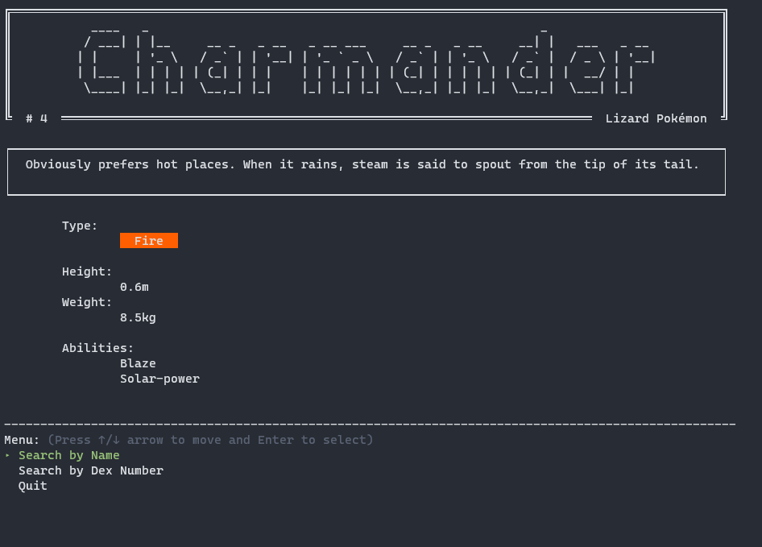

# PokeTerminal App

## Statement of Purpose and Scope

### What will this application do?

The Poketerminal Application allows for a user to search for the Pokedex entry of any of the 151 Kanto Pokemon via a Command Line Interface.

### What problem is the application solving?

It both allows the user to access the Pokedex entries through the terminal, as well as simulating what could have happened in game before the invention of the portable Pokedex.

### Who is the Target Audience?

Fans of the Pokemon franchise and players of the game.

# Features

## Search Functionality

The search functionality allows for the user to select to search either by the Pokemon's name or Dex ID

## API calling

the data accessed for the Pokedex entries come from the PokeApi (https://pokeapi.co/). With a highly detailed document, this made it a perfect API to utilize for accessing all the information required for the pokedex

## Enhanced UI

I wanted to provide as simple of an interface as possible for the user. Such as utilising "TTY-Prompt" for navigating the menu and large banners to make it visaully appealing.

## Gems utilised

- poke-api-v2

- tty-prompt

- tty-box

- tty-table

- tty-font

- rainbow

# UI, UX and Flowchart

## Start Screen

Users can select to either search by name or dex number via the prompt (or exit)

## Search

User is prompted to enter in the details of their search, in this case we enter a name.

## Dex Entry

Users are then presented with the Pokedex entry from the entered details.

## Flowchart

